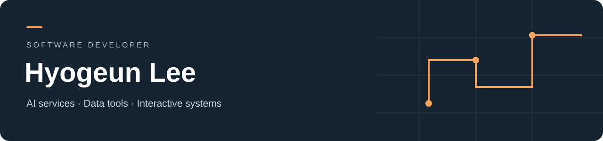

### 안녕하세요, 이효근입니다.

**데이터와 AI를 사용자가 직접 활용할 수 있는 서비스로 구현합니다.**

Python·FastAPI와 Java·Spring Boot로 API와 데이터 흐름을 만들고, React·Next.js와 Flutter로 사용자 화면을 연결해 왔습니다. 실시간 게임에서는 플레이어 상태와 네트워크 흐름을 다뤘습니다.

## Selected projects

<table>
<tr>
<td width="50%" valign="top">
<h3>01 · AI HomeSchooling</h3>

AI 친구 대화와 학습·게임을 연결한 웹 서비스.

<b>기여</b> · 3인 팀에서 Jiho·Teacher, 웹 서비스와 게임 구현. Isabella와 별도 오토레이터는 팀원 담당.

<b>근거</b> · 내부 장기기억 10문항 평가와 실패 분석. 기존 단위 테스트 23개 통과.

Python · FastAPI · React · Supabase

<a href="https://github.com/hardlyPw/AI_HomeSchooling">Repository ↗</a> · <a href="https://github.com/hardlyPw/AI_HomeSchooling/commit/cd92b2e">세션 분리 구현 ↗</a>
</td>
<td width="50%" valign="top">
<h3>02 · CulLecting</h3>

문화행사 탐색을 모바일 화면으로 연결한 Flutter 클라이언트.

<b>기여</b> · 로그인, 날짜·카테고리별 행사 조회, 검색·상세, 프로필 화면 구현.

<b>근거</b> · 팀 저장소의 본인 구현 커밋. 아카이빙 완료·출시 성과는 포함하지 않음.

Flutter · Dart · Provider · REST API

<a href="https://github.com/CulLecting/CulLecting-Android">Repository ↗</a> · <a href="https://github.com/CulLecting/CulLecting-Android/commit/b4ad219">기능 구현 ↗</a>
</td>
</tr>
<tr>
<td width="50%" valign="top">
<h3>03 · Seoul Multiplayer</h3>

달리기 메커니즘과 경기 상태를 연결한 Unity 멀티플레이 프로젝트.

<b>기여</b> · 4인 팀에서 자동 전진·대시·충돌 개선과 네트워크 공통부 구현.

<b>근거</b> · 플레이어 상태 머신, 로딩 완료 이후 생성, 경기 상태·점수 전파 코드.

Unity · C# · NGO · Relay

<a href="https://github.com/hardlyPw/Seoul_AI_GongmoJun">Repository ↗</a> · <a href="https://github.com/hardlyPw/Seoul_AI_GongmoJun/commit/56955a3">달리기 상태 머신 ↗</a>
</td>
<td width="50%" valign="top">
<h3>04 · Communication Analytics</h3>

경기와 발화 데이터를 함께 탐색하는 코칭 대시보드.

<b>기여</b> · 데이터 적재·DB·분석 API·타임라인과 차트 전체 개발.

<b>활용</b> · 실제 프로게이머와 코치가 인터뷰 과정에서 사용.

Java · Spring Boot · MySQL · Next.js

공개용 사례와 데모 자료 정리 중

</td>
</tr>
</table>

## How I build

- **서비스 흐름 연결** — 데이터 입력부터 API와 화면까지 이어지는 기능을 만듭니다.
- **상태와 경계 관리** — 대화 세션, 사용자 상태, 네트워크 객체의 수명을 나누어 다룹니다.
- **근거를 남기는 평가** — 실행 로그와 검색 결과를 살펴보고 실패 지점을 분석합니다.

## Community

GDGoC 활동에 참여했습니다. 커뮤니티 활동과 추가 팀 프로젝트의 담당 작업·산출물을 함께 정리하고 있습니다.
